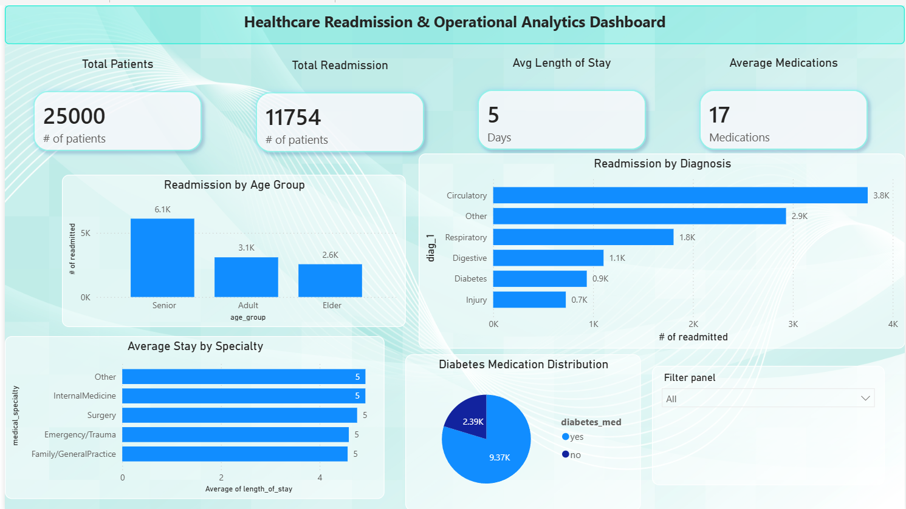
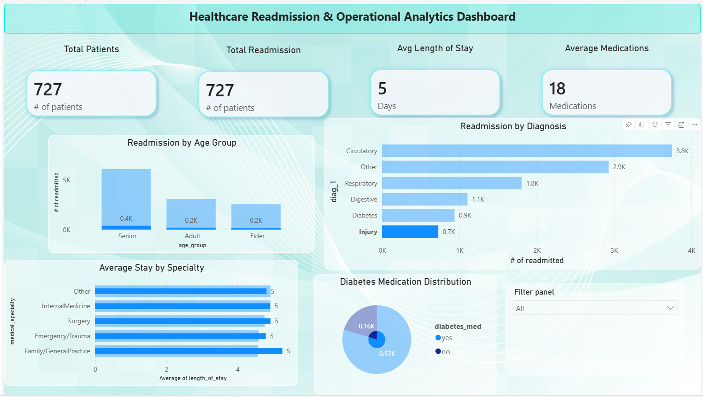
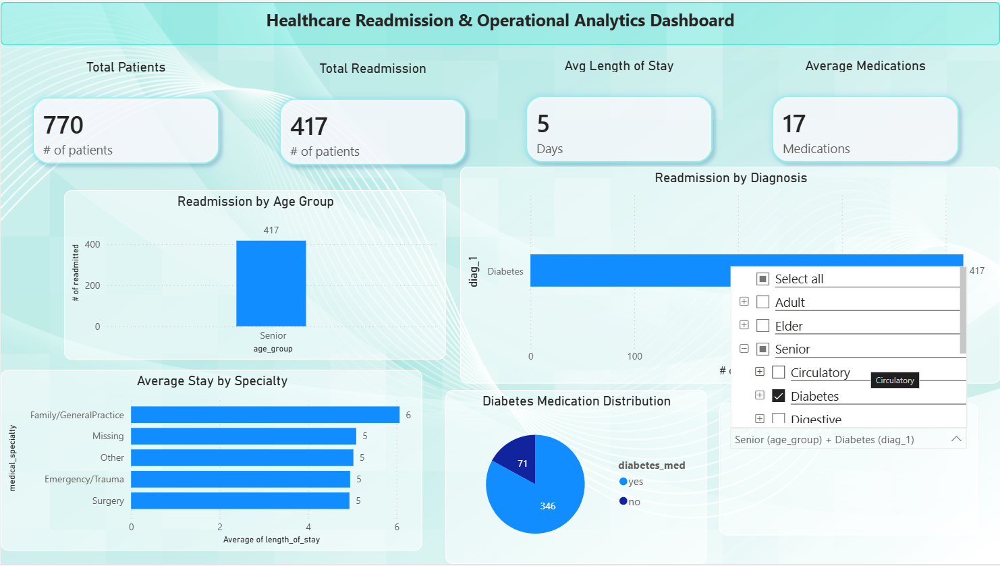
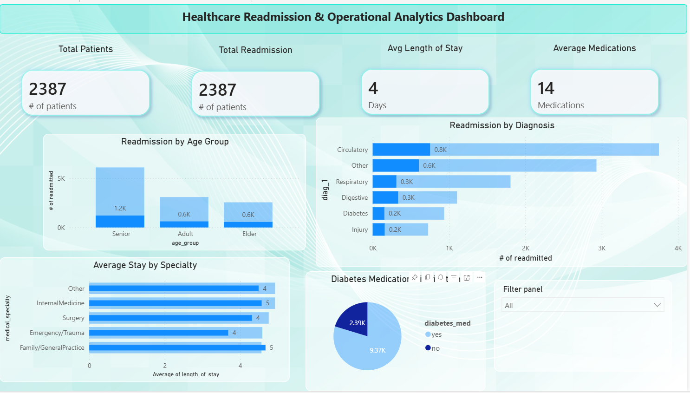

# 🏥 Healthcare Readmission & Operational Analytics Dashboard

## 📌 Project Overview

This project analyzes hospital patient readmission trends and operational healthcare metrics using Python, Pandas, and Power BI.

The goal of this project is to identify patterns related to patient readmissions, hospital stay duration, diagnosis categories, and healthcare operational indicators through interactive dashboard reporting and data analysis.

---

# 📊 Dashboard Preview

## Executive Overview Dashboard



---

# 🎯 Business Problem

Hospital readmissions are a major operational and financial challenge in healthcare systems.

This project explores:
- Patient readmission trends
- Diagnosis-based readmission patterns
- Length of hospital stay
- Medication usage
- Specialty-level operational insights

The dashboard is designed to support healthcare decision-making and operational analytics.

---

# 🛠 Tools & Technologies Used

- Power BI
- Python
- Pandas
- NumPy
- Google Colab
- DAX
- CSV Data Processing

---

# ⚙️ Data Cleaning & Feature Engineering

The dataset was cleaned and transformed using Python and Pandas.

Key preprocessing steps included:
- Missing value analysis
- Feature engineering
- Age group categorization
- Length of stay calculation
- KPI preparation
- Exporting cleaned data for Power BI visualization

---

# 📈 Dashboard Features

- Executive KPI cards
- Readmission analysis by age group
- Diagnosis-based readmission analysis
- Average hospital stay by specialty
- Diabetes medication distribution
- Interactive slicers and filtering
- Healthcare operational dashboard design

---

# 🔍 Key Insights

- Senior patients showed the highest readmission counts
- Circulatory diagnoses contributed the highest readmission volume
- Average hospital stay varied across medical specialties
- Most patients in the dataset were prescribed diabetes medication

---

# 📂 Project Structure

```text
healthcare-readmission-dashboard/
│
├── dashboard/
│   └── Healthcare_Readmission_Dashboard.pbix
│
├── notebook/
│   └── healthcare_analysis.ipynb
│
├── data/
│   └── cleaned_readmission_data.csv
│
├── images/
│   └── dashboard_overview.png
│
└── README.md
```
---
## Screenshots
---

---

---



# 👨‍💻 Author

## Syed Ahsan Sirat

Data Analytics Professional with experience in:
- Power BI dashboard development
- Python & Pandas data analysis
- Healthcare operational analytics
- Data visualization and reporting

### Connect With Me

- LinkedIn: [Syed Ahsan Sirat](https://www.linkedin.com/in/syedahsansirat/)
